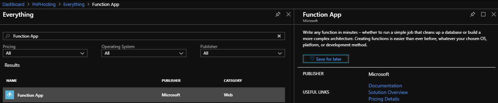
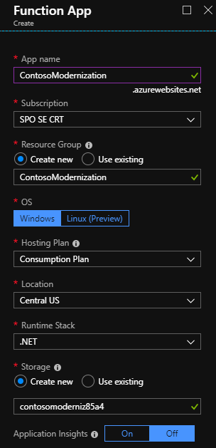
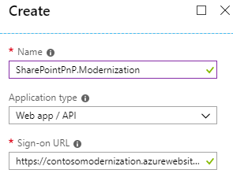
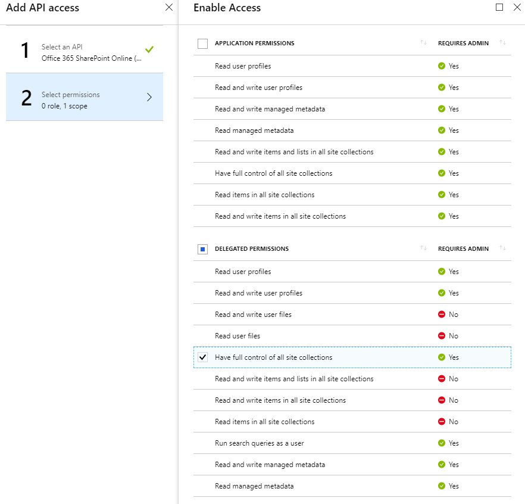
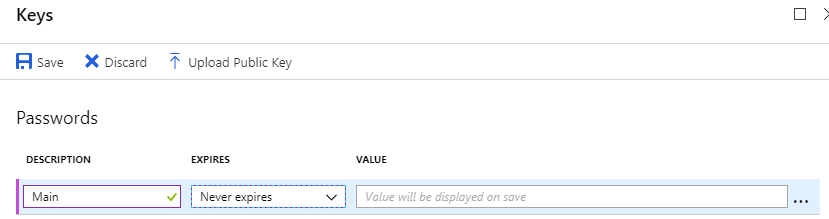
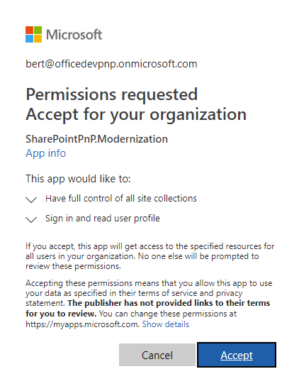
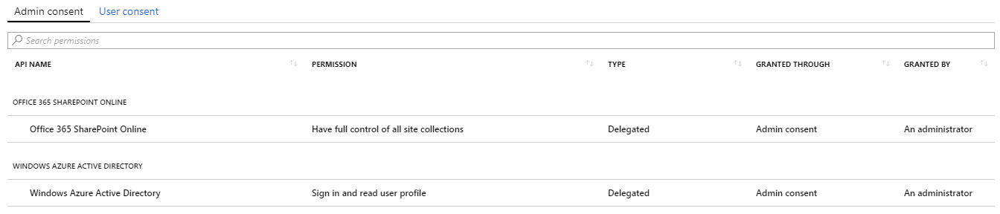
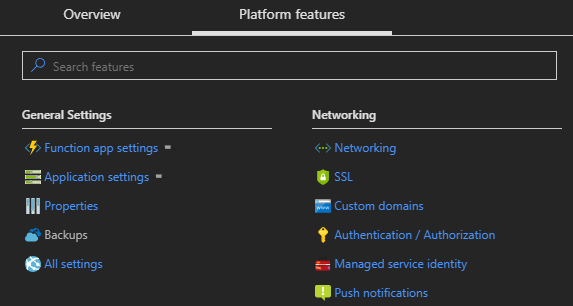
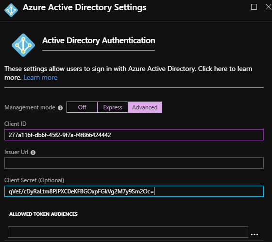
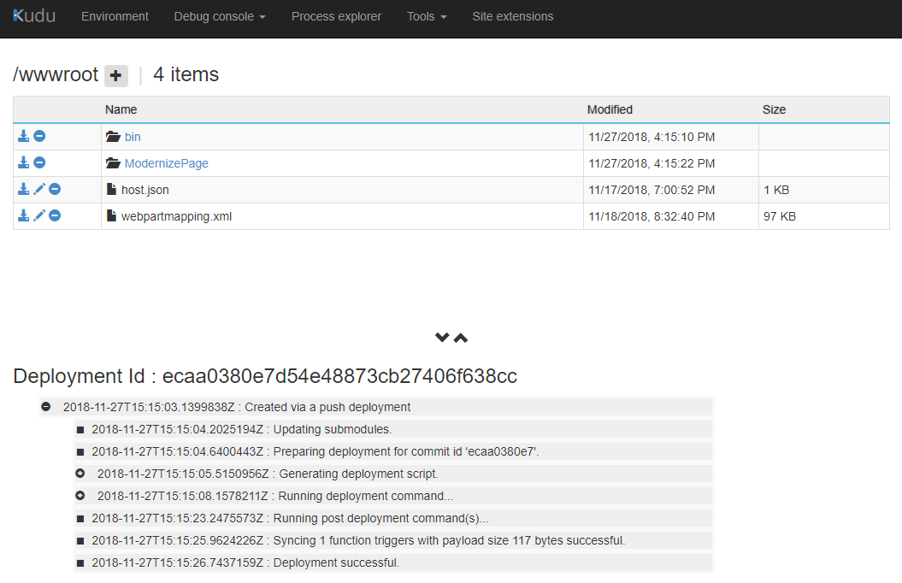

# Manual Azure setup

The page transformation UI depends on an Azure function to do the actual transformation work. The function is being called from the UI entry points (e.g. button in the wiki page ribbon) and then uses the SharePoint PnP Modernization Framework to create a modern version of the requested page. As we want the Azure function to operate as the user clicking on the button in the ribbon the Azure function will be secured via an Azure AD application. In this chapter you'll find the needed instructions to configure all Azure hosted components.

## Step 1: Create an Azure function App

Start with creating a new Azure Function App: it's needed to create a new Azure function app as we're going to secure this Azure function app using Azure AD application with specific permissions.

- Navigation to https://portal.azure.com
- Select the **Function App** to create



- Fill in the needed information: remember the app name (e.g. contosomodernization.azurewebsites.net) as you'll need that one later on
  


- Set the function runtime to version 1 by clicking on **Function App Settings** and then choosing **~1** as runtime version

## Step 2: Create and configure an Azure AD application

The Azure AD application will be used to secure the created Azure function.

- Navigate to https://aad.portal.azure.com which will load the Azure Active Directory admin center
- Click on **Azure Active Directory** in the left navigation
- Click on **App registrations** in the Manage section
- Click on **New application registration**
- Create an application with name **SharePointPnP.Modernization**. It's important that you use this name! As sign-on URL specify the URL for the earlier created Azure Function App. **Copy the application ID as you'll need it later on**.



- Open up **Settings** pane and select **Required permissions**
- Click **Add** and in **Select an API** choose **Office 365 SharePoint Online**
- Check the **Have full control of all site collections** delegated permission and click **Save**



- From the **Settings** page select **Reply URLs** and a URL formatted like `https://<your function app>/.auth/login/aad/callback`, so in our case that will be `https://contosomodernization.azurewebsites.net/.auth/login/aad/callback`
- From the **Settings** page select **Keys** and add a password that never expires. **Copy the key value as you'll need it later on**.



- Click on **Enterprise applications** from the Azure Active Directory admin center menu and paste in **SharePointPnP.Modernization** in the search filter. This will load the SharePointPnP.Modernization application, click on it to open it
- Click on **Permissions** in the left navigation followed by clicking on the **Grant admin consent for...** button. This will allow you as Azure AD administrator to consent the application once for all users:



- The result will shown below:



## Step 3: Configure the Azure function created in step 1

Now that we created the Azure AD application we can finalize the configuration of our Azure Function App.

- Navigation to https://portal.azure.com and open the earlier created Azure Function App
- Click on **Platform features** to show the configuration options



- Select **Authentication/Authorization** from the **Networking** section
- Toggle **App Service Authentication** to **On** and click on **Azure Active Directory**
- Select the **Advanced** management mode and provide the **Client ID** and **Client Secret** you configured for your Azure AD application and hit **OK**



- Click on **Platform features** and select **Cors** from the **Api** section
- Add your SharePoint host as **Allowed origin** e.g. https://contoso.sharepoint.com and hit **Save**
- Click on **Platform features** and select **Application settings** from the **General settings** section
- Scroll down to the **Application settings** section and the following application settings:

    - **CLIENT_ID**: the ID of the earlier created Azure AD application
    - **CLIENT_SECRET**: the secret created for our Azure AD application

- Press **Save** to persist the changes

## Step 4: deploy the SharePoint Modernization service binaries to the Azure Function App

### Option A: Using Kudu

The easiest way to deploy the Azure Function app binaries is by using Kudu:

- Click on **Platform features** and select **Advanced tools (Kudu)** from the **Development Tools** section
- In Kudu use the **Tools** menu and select **Zip Push Deploy**
- Drag the **sharepointpnpmodernizationeurope.zip** file inside the wwwroot folder pane
- The zip file be uploaded and deployed. A successful deployment will result in this:



### Option B: Use Visual Studio 2017

If you do have Visual Studio 2017 installed then you can open the **ModernizationService** project from under the services folder, right-click on the **ModernizationFunction** project inside and choose **Publish**.

>Note:
>The first time you do this you need to connect to your earlier created Azure Function app.

Using this approach allows you for example easily update the webpartmapping.xml file before deployment, which is needed in case you want to alter the out-of-the-box mapping definition.

### Option C: Use PowerShell

If you don't have Visual Studio 2017 available you can deploy the **sharepointpnpmodernizationeurope.zip** (available in the **provisioning**) folder to the Azure Function App as described in the [Zip Deployment](https://docs.microsoft.com/en-us/azure/azure-functions/deployment-zip-push) article. Below snippet shows the PowerShell script that automates the model described in the mentioned article.

```Powershell
# First navigate to the provisioning folder and then call below script
.\Update-ModernizationFramework.ps1 -SubscriptionName "subscription" -ResourceGroupName "group" -FunctionAppName "functionname"
```
