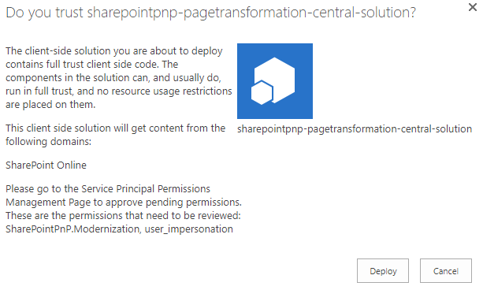
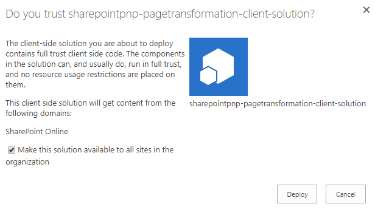
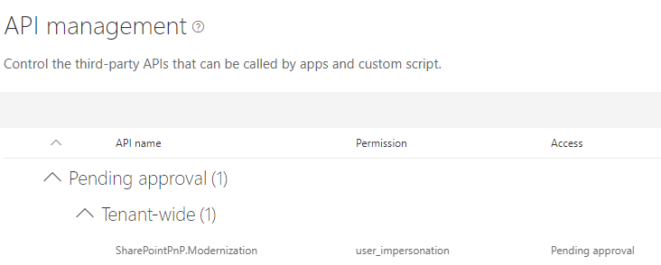
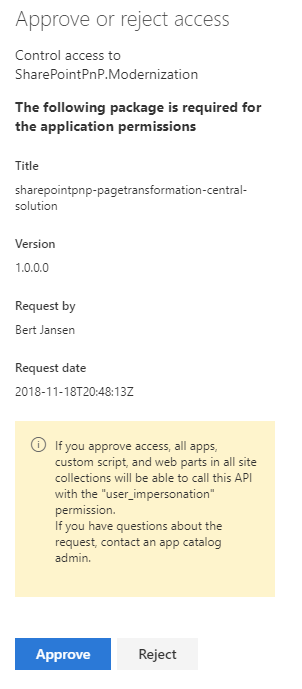
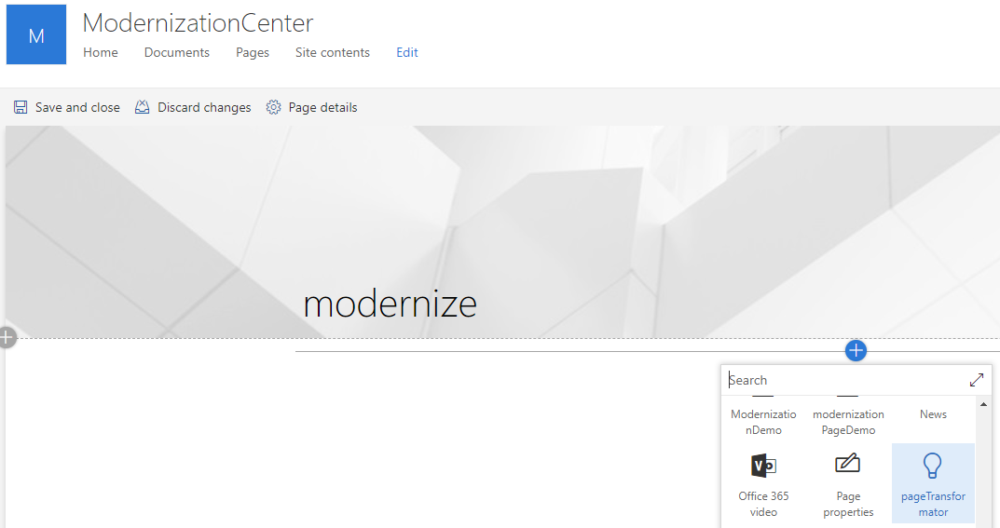
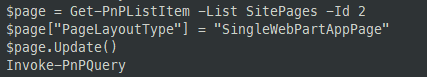

# Manual SharePoint setup

Page transformation depends on a SharePoint modernization center site being present and configured, a number of web parts being deployed and finally some user custom actions being installed in the site collections that want to use page transformation.

## Step 1: Deploy the SharePoint Framework solutions

The solution uses two web parts which are wrapped into two solutions. Both solution need to be installed:

- Navigate to the **assets** folder in your cloned GitHub repository or go the GitHub repo (e.g. https://github.com/SharePoint/sp-dev-modernization/tree/dev/Solutions/PageTransformationUI/assets) and download all assets
- Open up your tenant app catalog via going to the SharePoint Admin center (e.g. https://contoso-admin.sharepoint.com), clicking on **Apps** and then on **App Catalog**. If there's no app catalog site yet you'll be asked to provision one first
- In the SharePoint app catalog navigate to **Apps for SharePoint** via the left navigation
- Drag the **sharepointpnp-pagetransformation-central.sppkg** from the assets folder into the **Apps for SharePoint list**



- Click on **Deploy** to deploy this application
- Drag the **sharepointpnp-pagetransformation-client.sppkg** from the assets folder into the **Apps for SharePoint list**



- Check the **Make this solution available to all sites in the organization** checkbox and click **Deploy**. Note that the deployed web part will not show up in the web part picker, so it will not cause any confusion even if deployed to all your sites in your tenant
- Open the new SharePoint admin center via going to the classic SharePoint Admin center (e.g. https://contoso-admin.sharepoint.com), clicking on **Try it now** in the banner
- In the new admin center click on **API management** in the left navigation and you'll see an pending approval:



- Select the **SharePointPnP.Modernization** API request and click **Approve**



## Step 2: Create the Modernization Center site collection

The **Modernization center** site collection acts as a central hub to drive page transformation. 

- Use the waffle in the suite bar navigation and go to **SharePoint**
- Click on **Create site** and create a new communication site with name **ModernizationCenter** (please keep this name as it will ease the further setup)
- Load up [PnP PowerShell](http://aka.ms/sppnp-powershell) and navigate to the assets folder you downloaded in step 1
- Connect to the created site collection via `Connect-PnPOnline -Url https://contoso.sharepoint.com/sites/modernizationcenter`
- Apply a template to this site: `Apply-PnPProvisioningTemplate -Path .\modernizationcenter.xml`

**TODO:** should end up in the template, but for now manual steps

- Install the **sharepointpnp-pagetransformation-central-solution** solution into this site via calling `Get-PnPApp`, copying the ID of the **sharepointpnp-pagetransformation-central-solution** solution and then using that in `Install-PnPApp -Identity <guid id>`
- Navigate to the **Pages** and create a page named **Modernize** (please keep this page name as it will ease the further setup)
- Add the **pageTransformator** web part on that page



- Switch the created page to being an **SingleWebPartAppPage**:



- Navigate to the **Pages** library and **Publish** the **modernize.aspx** page

- Grant **everyone but externals** view permissions to this site
- Grant **everyone but externals** edit permissions on the ModernizationFeedback list
- Upload the **modernize32x32.png** and **modernize16x16.png** to the root of the **Site Assets** library

## Step 3: Configure the Storage entities

Use the below [PnP PowerShell](http://aka.ms/sppnp-powershell) cmdlets to add the needed configuration to make the solution come to live. Use the respective values from the earlier created Azure AD application and Azure Function app.

```PowerShell
Set-PnPStorageEntity -Key "Modernization_AzureADApp" -Value "79ad0500-1230-4f7a-a5bb-5e83ce9174f4" -Description "ID of the Azure AD app is used for page transformation"
Set-PnPStorageEntity -Key "Modernization_FunctionHost" -Value "https://contosomodernization.azurewebsites.net" -Description "Host of the SharePoint PnP Modernization service"
Set-PnPStorageEntity -Key "Modernization_PageTransformationEndpoint" -Value "api/ModernizePage" -Description "Api endpoint for page transformation"
Set-PnPStorageEntity -Key "Modernization_CenterUrl" -Value "/sites/modernizationcenter" -Description "Site relative URL for the modernization center in this tenant"
Set-PnPStorageEntity -Key "Modernization_FeedbackList" -Value "ModernizationFeedback" -Description "Name of the created feedback list"
Set-PnPStorageEntity -Key "Modernization_LearnMoreUrl" -Value "https://aka.ms/sppnp-modernize" -Description "Url shown in the learn more link"  
```

## Step 3: Making page transformation available for a site collection

Final step is ensuring that the Page Transformation UI elements appear. This is done per site collection by installing a template.

- Load up [PnP PowerShell](http://aka.ms/sppnp-powershell) and navigate to the assets folder you downloaded in step 1
- Connect to the site collection that wants to use page transformation via `Connect-PnPOnline -Url https://contoso.sharepoint.com/sites/sitethatwantspagetransformation`
- Apply a template to this site: `Apply-PnPProvisioningTemplate -Path .\clienttemplate.xml`
