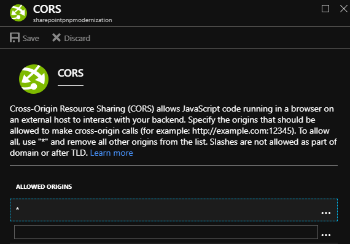

# Setting up your created Azure Function as multi-tenant function

Companies often have multiple (test) tenants and then it makes sense to have only one Azure function app setup for page transformation. This can be done by first configuring you Azure function app for multi-tenant usage:

## Azure AD configuration

- Navigation to https://admin.microsoft.com which will load up the Office 365 Admin Center
- Expand the **Admin centers** dropdown in the left navigation and select **Azure Active Directory** which will load the Azure Active Directory admin center
- Click on **Azure Active Directory** in the left navigation
- Click on **App registrations** in the Manage section
- Enter **SharePointPnP.Modernization** in the filter and select **All apps**. This should find the earlier created Azure AD application
- Open up **Settings** pane and select **Properties** and toggle the **Multi-tenanted** toggle

## Azure Function App configuration

- Navigation to https://portal.azure.com and open the earlier created Azure Function App
- Click on **Platform features** and select **Cors** from the **Api** section
- Remove all URL's and add a star (*) as **Allowed origin** and hit **Save**

- Click on **Platform features** and select **Application settings** from the **General settings** section
- Scroll down to the **Application settings** section and the following application settings:

    - **AllowedTenants**: this contains a comma delimited list of tenants that you allow to use this function e.g. **bertonline.onmicrosoft.com,officedevpnp.onmicrosoft.com**

- Press **Save** to persist the changes
