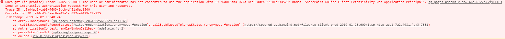
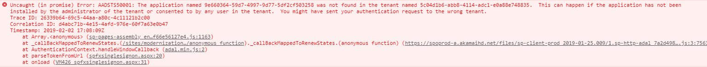
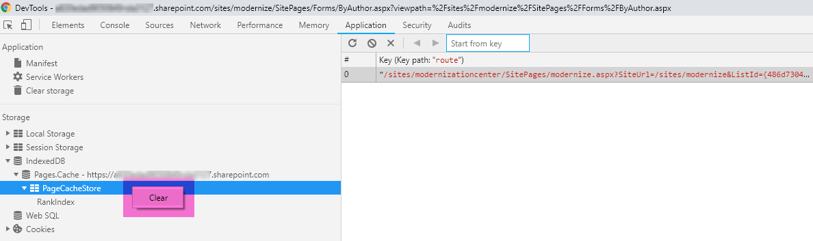

# Page transformation UI setup troubleshooting guide

Setting up the Page Transformation UI solution does involve work at the Azure side and SharePoint side and does mean running scripts with some manual steps in between. As a result sometimes the setup is not 100% complete and page transformation does not work for you. If that's the case then please use this troubleshooting guide to correct your setup. If this still does not get you unblocked then please create an issue in the [sp-dev-modernization issue list](https://github.com/SharePoint/sp-dev-modernization/issues).

## General step by step validation of the setup (recommended)

Follow the guidance in here if you want to verify your complete setup. To start with the validation please execute the below [PnP PowerShell](https://aka.ms/sppnp-powershell):

```PowerShell
Get-PnPStorageEntity

Key                                      Value
---                                      -----
Modernization_AzureADApp                 8e660364-59d7-4997-9d77-5df2cf503258
Modernization_FunctionHost               https://pnpmodernizationtest3.azurewebsites.net
Modernization_PageTransformationEndpoint api/ModernizePage
Modernization_CenterUrl                  /sites/modernizationcenter
Modernization_FeedbackList               ModernizationFeedback
Modernization_LearnMoreUrl               https://aka.ms/sppnp-pagetransformationui-manual
```

### Azure Function App validation

Open the created Function App in the Azure Management portal:

- Go to https://portal.azure.com and select **All resources**
- Filter on **Type** by selecting the **App Service** type
- Open the Function App you've created via the script
- _CHECK A1:_ In the Overview tab check the URL: **Does the URL listed match the URL listed in the Modernization_FunctionHost storage entity**?
- Under **Configured features** you should see at the minimal **Authentication** and **Application settings**. Click on **Application settings**
- Scroll down to the **Application settings** section and click on **Show values**
- _CHECK A2:_ At the minimal you should see here **CLIENT_ID equal to the Modernization_AzureADApp storage entity** and **CLIENT_SECRET** set to a key value

> Note:
> If one or more _CHECKS_ returned an issue then your Azure Function App was not properly configured. Remediation steps are listed **Remediation steps** chapter below.

### Azure AD Application validation

Open the created Azure AD Application in the Azure AD Management portal:

- Go to https://aad.portal.azure.com and select **Azure Active Directory**
- Under **Manage** select **App registrations**, enter **SharePoint** in the search box and set the dropdown to **All apps**
- Open the **SharePointPnP.Modernization** app
- _CHECK B1:_ **Does the Application ID match with the value of to the Modernization_AzureADApp storage entity**?
- Open the managed application by clicking on **SharePointPnP.Modernization** underneath **Managed application in local directory**
- Go to **Permissions** underneath **Security**
- _CHECK B2:_ Under the **Admin consent** tab **you see 2 consented permissions (Have full control of all site collections) and (Sign in and read user profile)**?

> Note:
> If one or more _CHECKS_ returned an issue then your Azure AD App was not properly configured. Remediation steps are listed **Remediation steps** chapter below.

### SharePoint validation

Open a [PnP PowerShell](https://aka.ms/sppnp-powershell) session, save and update below script and then run it:

```PowerShell
try
{
    $credentials = Get-Credential
    # IMPORTANT: update to point to the created modernization center
    Connect-PnPOnline -Url https://mytenant.sharepoint.com/sites/modernizationcenter -Credentials $credentials
    Write-Host "Connection to modernization center ok" -ForegroundColor Green
    Connect-PnPOnline -Url (Get-PnPTenantAppCatalogUrl) -Credentials $credentials
    Write-Host "Connection to corporate App Catalog ok" -ForegroundColor Green
    Get-PnPSiteCollectionAdmin -Web (Get-PnPWeb)
    Write-Host "Verify your account" $credentials.UserName "is one of the tenant app catalog admins listed below" -ForegroundColor Yellow
    Disconnect-PnPOnline
}
catch [Exception] 
{
    $ErrorMessage = $_.Exception.Message
    Write-Host "Error: $ErrorMessage" -ForegroundColor Red
}
```

- _CHECK C1:_ **Do you see an error being returned? If so then please verify you do have the modernization center site available and you do have an app catalog defined in your tenant**
- _CHECK C2:_ **Is your username listed as admin for the tenant app catalog?**

Open a [PnP PowerShell](https://aka.ms/sppnp-powershell) session and run the below command:

```PowerShell
Get-PnPTenantServicePrincipalPermissionGrants


ClientId    : 4b1d6340-3782-4ace-ac61-43770583ced2
ConsentType : AllPrincipals
ObjectId    : QGMdS4I3zkqsYUN3BYPO0pEcF1xIsZZKoKbdQN0yDjY
Resource    : SharePointPnP.Modernization
ResourceId  : 5c171c91-b148-4a96-a0a6-dd40dd320e36
Scope       : user_impersonation
```

- _CHECK C3:_ **You do see a permission for resource SharePointPnP.Modernization and scope user_impersonation**?


> Note:
> If one or more _CHECKS_ returned an issue then the SharePoint side was not properly configured. Remediation steps are listed **Remediation steps** chapter below.

## Validation based upon seen error messages

The common place to see an error is on the **Modernize.aspx** page in the **ModernizationCenter** site collection. If that's the case then pressing F12 opens up the **Developer tools**. Go to the **console** view and check for the presence of following errors

### AADSTS65001: The user or administrator has not consented the use of application with ID 'xx' named 'SharePoint Online Client Extensibility Web Application Principal'



This error will be seen if _CHECK B2_ or _CHECK C1_ (see above) is an issue. Remediation steps are listed **Remediation steps** chapter below.

### Error AADSTS50001: The application named 'guid' was not found in the tenant named 'guid'



This error will be seen if _CHECK B1_ (see above) is an issue. Remediation steps are listed **Remediation steps** chapter below.

## Remediation steps

### Check A1 (wrong function app URL)

Use `Set-PnPStorageEntity -Key Modernization_FunctionHost -Value https://xxx.azurewebsites.net` to configure the correct Azure Function app url.

When you're using Chrome as your browser then before testing again you need to clear the modern page cache by pressing F12 to open the **Developer tools**:

- Go to the **Application** tab
- Under **storage** go the **IndexedDB**, **Pages.Cache**
- Right click **PageCacheStore** and click on **Clear**
- Restart the browser



### Check A2 (wrong app settings)

If the app settings are all missing then something went really wrong during the automated setup. The best solution is to re-install the page transformation UI solution. To do so first follow the steps in the **Fully remove the Page Transformation UI solution** chapter to remove the currently installed bits and then follow the [deployment guide](deploymentguide.md) to install again.

### Check B1 (Azure AD app id mismatch)

Find the **SharePointPnP.Modernization** Azure AD application, copy the **application ID** and then configure the **Modernization_AzureADApp** storage entity to use it.

Use `Set-PnPStorageEntity -Key Modernization_AzureADApp -Value <Azure application ID guid>` to configure the correct Azure AD App application ID.

When you're using Chrome as your browser then before testing again you need to clear the modern page cache by pressing F12 to open the **Developer tools**:

- Go to the **Application** tab
- Under **storage** go the **IndexedDB**, **Pages.Cache**
- Right click **PageCacheStore** and click on **Clear**
- Restart the browser


### Check B2 (missing admin consent)

- Go to https://aad.portal.azure.com and select **Azure Active Directory**
- Under **Manage** select **App registrations**, enter **SharePoint** in the search box and set the dropdown to **All apps**
- Open the **SharePointPnP.Modernization** app
- Open the managed application by clicking on **SharePointPnP.Modernization** underneath **Managed application in local directory**
- Go to **Permissions** underneath **Security**
- Click on **Grant admin consent for...** and perform the admin consent of the needed delegated permissions

When you're using Chrome as your browser then before testing again you need to clear the modern page cache by pressing F12 to open the **Developer tools**:

- Go to the **Application** tab
- Under **storage** go the **IndexedDB**, **Pages.Cache**
- Right click **PageCacheStore** and click on **Clear**
- Restart the browser


### Check C1 (error during app center validation)

- Did you create the modernization center site collection (see the SharePoint section of the [deployment guide](deploymentguide.md))
- Did you update the modernization center URL in the PowerShell test script? If not update it and run again
- Do you not have a tenant app catalog? 
  - Go to your SharePoint Admin center
  - Click on **Apps** --> **App Catalog**
  - If you're redirected to the app catalog site collection then all good, if not please create the app catalog site collection

### Check C2 (not admin of the app catalog)

- You have to be an admin before you can deploy applications to the app catalog. To make yourselves an admin follow these steps:
  - Go to your SharePoint Admin center
  - Click on **Site collections** and search your app center site collection
  - Select you app center site collection
  - Click on **Owners** --> **Manage Administrators**
  - Add yourselves to the **Site Collection Administrators** list and click on **OK**

### Check C3 (missing SharePoint permission grant)

Use `Grant-PnPTenantServicePrincipalPermission -Scope "user_impersonation" -Resource "SharePointPnP.Modernization"` to grant the needed permission to the SharePoint Client Extensibility SharePoint app.

When you're using Chrome as your browser then before testing again you need to clear the modern page cache by pressing F12 to open the **Developer tools**:

- Go to the **Application** tab
- Under **storage** go the **IndexedDB**, **Pages.Cache**
- Right click **PageCacheStore** and click on **Clear**
- Restart the browser


## Fully remove the Page Transformation UI solution

Sometimes the best option is to reinstall the Page Transformation UI solution again. Before doing so follow these steps to fully remove the solution from your environment.

### Azure cleanup

- Delete the Azure Function app. If you used a dedicated Resource group during the setup then simply delete that Resource group. Alternatively you can delete the Azure components created by the Function app setup:
  - Delete the Azure Function app
  - Delete the created Azure Storage account
  - Delete the created Azure App Service Plan
- Remove the **SharePointPnP.Modernization** AD App

### SharePoint cleanup

To cleanup the SharePoint side save and update below [PnP PowerShell](https://aka.ms/sppnp-powershell) script and then execute it:

```PowerShell
# IMPORTANT: update the site collection URL in the last line of the script before running

# Remove the installed apps
$appToRemove = Get-PnPApp | Where-Object {$_.Title -eq "sharepointpnp-pagetransformation-central-solution"}
Remove-PnPApp -Identity $appToRemove.Id
$appToRemove = Get-PnPApp | Where-Object {$_.Title -eq "sharepointpnp-pagetransformation-client-solution"}
Remove-PnPApp -Identity $appToRemove.Id

# Revoke the grants
$grantstorevoke = Get-PnPTenantServicePrincipalPermissionGrants | Where-Object {$_.Resource -eq "SharePointPnP.Modernization"}
Revoke-PnPTenantServicePrincipalPermission -ObjectId $grantstorevoke.ObjectId -Force

# Clean up the pending requests (if any)
$requestsrevoke = Get-PnPTenantServicePrincipalPermissionRequests | Where-Object {$_.Resource -eq "SharePointPnP.Modernization"}
foreach ($request in $requestsrevoke) { Deny-PnPTenantServicePrincipalPermissionRequest -RequestId $request.Id -Force }

# Delete the created site collection
Remove-PnPTenantSite -Url https://mytenant.sharepoint.com/sites/modernizationcenter -SkipRecycleBin -Force
```

 When using Chrome as a browser finalize by clearing the modern page cache by pressing F12 to open the **Developer tools**:
  - Go to the **Application** tab
  - Under **storage** go the **IndexedDB**, **Pages.Cache**
  - Right click **PageCacheStore** and click on **Clear**
  - Restart the browser