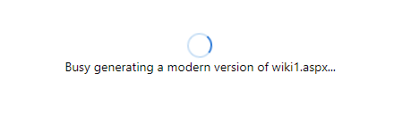

# SharePoint Framework solutions

This folder contains the SharePoint Framework (SPFX) components of the Page Transformation UI solution. Following SharePoint Framework components are used:

**A PageTransformator web part**: this web part is hosted on a central page (modernize.aspx) in the modernization center site collection. This web part is responsible for calling the Azure AD secured Azure Function on behalf of the current user

**A PageAcceptBanner web part**: this web part will be added on the transformed pages and does allow an end users to accept/decline to transformed page

